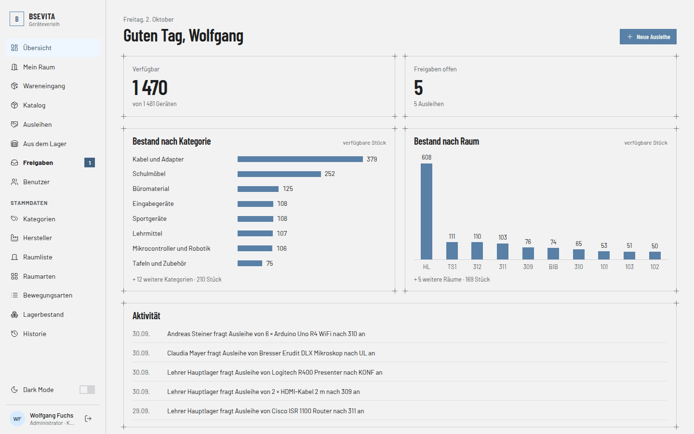

# Lagerverwaltung – BSEVITA Geräteverleih

Webanwendung, mit der die Schule verwaltet, welche Geräte und Materialien sich in welchem Raum befinden. Jede Änderung am Bestand wird als **Lagerbewegung** gebucht und bleibt in der Historie nachvollziehbar.

## Funktionen

* **Übersicht**: verfügbarer Bestand, offene Freigaben, Diagramme nach Kategorie und Raum sowie die letzten Buchungen.
* **Katalog**: alle Gegenstände mit Suche und Filter nach Kategorie, Raum, Status und Hersteller. Admins erfassen, bearbeiten und löschen Gegenstände.
* **Mein Raum**: Bestand des eigenen Raums, offene Anfragen und Übernahmen.
* **Wareneingang**: neue Gegenstände (z. B. nach einer Lieferung) in den eigenen Raum einbuchen.
* **Aus dem Lager holen** und **Ausleihen**: Geräte aus dem Hauptlager bzw. Umbuchungslager anfordern oder an einen anderen Raum weitergeben. Die Suche funktioniert auch mit einem USB-Handscanner.
* **Freigaben**: Die verantwortliche Person des Zielraums bzw. Lagers bestätigt oder lehnt Anfragen ab. Bis dahin kann die anfragende Person die Anfrage zurückziehen.
* **Administration**: Benutzer und Rollen, Stammdaten (Kategorien, Hersteller, Räume, Raumarten, Bewegungsarten), Bestandskorrektur nach einer Inventur und Historie aller Lagerbewegungen mit Filter und CSV-Export.
* Dark Mode und eigene Ansicht für Smartphones.

Was jemand sehen und tun darf, hängt von der **Rolle** (Admin oder nicht) und der **Raumverantwortung** ab: Jede Person ist für höchstens einen Raum verantwortlich, und nur sie darf aus diesem Raum buchen und Anfragen dafür freigeben.

## Technik

* ASP.NET Core MVC mit .NET 10
* Entity Framework Core mit SQL Server (Standard: LocalDB)
* Anmeldung per Cookie, Passwörter mit Hash und Pepper
* Bootstrap, jQuery und Lucide-Icons im Frontend

## Starten

1. `Docs/Datenbankskript.sql` in SQL Server Management Studio ausführen. Das Skript legt die Datenbank `Lagerverwaltung` an.
2. *(Optional)* Testdaten mit `Lagerverwaltungsapp-MatthiasUtrata/Testdaten.sql` einspielen.
3. Verbindung bei Bedarf in `appsettings.json` unter `ConnectionStrings:DefaultConnection` anpassen.
4. `Lagerverwaltung.slnx` in Visual Studio starten oder im Projektordner `dotnet run` ausführen.
5. Im Browser `https://localhost:7019` bzw. `http://localhost:5191` öffnen.

Ist die Datenbank leer, erscheint statt der Anmeldung die Registrierung. Die erste Person, die sich registriert, wird Administrator. Mit Testdaten kann man sich z. B. als `admin` / `admin` anmelden. Alle Testkonten stehen im [Tutorial](Tutorial.md#2-anwendung-starten-und-testkonten).

## Projektstruktur

| Ordner / Datei | Inhalt |
|---|---|
| `Lagerverwaltungsapp-MatthiasUtrata/` | Quellcode der Anwendung (Controllers, Models, Services, Views) |
| `Docs/` | Datenbankskript, ER-Diagramm und technische Dokumentation |
| `Mockups/` | Screenshots der Oberfläche |
| `Tutorial.md` | Ausführliche Bedienungsanleitung mit allen Seiten |

## Autor

Matthias Utrata
