# Tutorial: BSEVITA Geräteverleih (Lagerverwaltung)

Dieses Tutorial erklärt die Bedienung der Lagerverwaltungs-App Schritt für Schritt, mit allen Seiten der Anwendung. Die Screenshots stammen aus der laufenden Anwendung mit den Testdaten aus `Testdaten.sql`.

## Inhalt

1. [Überblick](#1-überblick)
2. [Anwendung starten und Testkonten](#2-anwendung-starten-und-testkonten)
3. [Erste Schritte](#3-erste-schritte)
4. [Übersicht (Startseite)](#4-übersicht-startseite)
5. [Katalog](#5-katalog)
6. [Mein Raum](#6-mein-raum)
7. [Wareneingang](#7-wareneingang)
8. [Aus dem Lager holen](#8-aus-dem-lager-holen)
9. [Ausleihen (Transfer anfragen)](#9-ausleihen-transfer-anfragen)
10. [Freigaben](#10-freigaben)
11. [Profil](#11-profil)
12. [Scannen](#12-scannen)
13. [Administration](#13-administration)
14. [Mobile Ansicht](#14-mobile-ansicht)
15. [Häufige Fragen und Meldungen](#15-häufige-fragen-und-meldungen)

---

## 1. Überblick

Mit der App verwaltet die Schule, welche Geräte und Materialien sich in welchem Raum befinden. Jede Änderung am Bestand wird als **Lagerbewegung** gebucht und bleibt in der Historie nachvollziehbar.

### Wichtige Begriffe

| Begriff | Bedeutung |
|---|---|
| **Gegenstand** | Eintrag im Katalog, z. B. „Epson EB-W49 Beamer“. **Mit Seriennummer** steht ein Eintrag für genau ein Gerät (Menge immer 1). **Ohne Seriennummer** wird der Gegenstand über die Menge geführt (z. B. 30 Stück „HDMI-Kabel 2 m“). |
| **Raum** | Ort mit einer Raumnummer (z. B. `101`, `HL`, `KONF`) und einer Raumart (z. B. Klassenzimmer, Labor, Hauptlager). |
| **Raumbestand** | Wie viel von einem Gegenstand gerade in einem Raum liegt. |
| **Lager** | Räume, deren Raumart „lager“ im Namen trägt, also **HL** (Hauptlager) und **UL** (Umbuchungslager). Aus ihnen kann man Geräte in den eigenen Raum holen. |
| **Lagerbewegung** | Eine Buchung: *Gegenstand × Menge von Raum A nach Raum B*, mit Bewegungsart (z. B. Ausgabe, Rückgabe, Reparatur). |
| **Freigabe** | Ein Transfer gilt erst, wenn die **andere Seite** ihn bestätigt (digitale Übernahme). Bis dahin ist die Menge „unterwegs“. |

### Rollen und Zuständigkeit

Was jemand sehen und tun darf, hängt von zwei Dingen ab:

* **Admin-Rolle** (z. B. „Administrator“): Zugriff auf Benutzerverwaltung, Stammdaten, Lagerbestand und Historie.
* **Raumverantwortung**: Jede Person kann für **höchstens einen Raum** verantwortlich sein. Nur die verantwortliche Person darf aus ihrem Raum buchen und Anfragen für ihren Raum freigeben. Das gilt **auch für Admins**: Ein Admin ohne Raum kann nichts transferieren.

| Menüpunkt | Alle angemeldeten Personen | Nur mit eigenem Raum | Nur Admins |
|---|:---:|:---:|:---:|
| Übersicht, Katalog, Ausleihen | ✔ | | |
| Mein Raum, Wareneingang, Aus dem Lager, Freigaben | | ✔ | |
| Benutzer und alle *Stammdaten* (Kategorien, Hersteller, Raumliste, Raumarten, Bewegungsarten, Lagerbestand, Historie) | | | ✔ |

> Wer eine Seite ohne Berechtigung aufruft (z. B. `/Admin` als Lehrerin), sieht „Zugriff verweigert“:
>
> 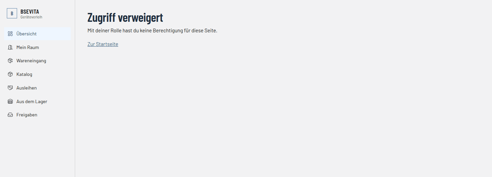

---

## 2. Anwendung starten und Testkonten

1. Datenbank anlegen: `Docs/Datenbankskript.sql` in SQL Server Management Studio ausführen. Das Skript legt die Datenbank `Lagerverwaltung` mit allen Tabellen an.
2. *(Optional)* Testdaten einspielen: `Lagerverwaltungsapp-MatthiasUtrata/Testdaten.sql` ausführen.
3. Die Verbindung steht in `appsettings.json` unter `ConnectionStrings:DefaultConnection` (Standard: LocalDB `(localdb)\MSSQLLocalDB`).
4. `Lagerverwaltung.slnx` in Visual Studio öffnen und starten, oder im Projektordner `dotnet run` ausführen.
5. Im Browser öffnen: `http://localhost:5191` (Profil „http“) bzw. `https://localhost:7019` (Profil „https“).

**Testkonten** (aus `Testdaten.sql`):

| Benutzername | Passwort | Rolle | Verantwortlich für Raum |
|---|---|---|---|
| `admin` | `admin` | Administrator | – |
| `hauptlager` | `hauptlager` | LehrerIn | HL (Hauptlager) |
| `umbuchungslager` | `umbuchungslager` | LehrerIn | UL (Umbuchungslager) |
| `wfuchs` | `Test1234` | Administrator | KONF (Konferenzzimmer) |
| `meder` | `Test1234` | Administrator | SEK (Verwaltung) |
| `ahuber` | `Test1234` | LehrerIn | 101 (Klassenzimmer) |
| `tgruber` | `Test1234` | LehrerIn | 102 (Klassenzimmer) |
| `mbauer` | `Test1234` | Laborvorstand | 309 (Labor) |
| `kwimmer` | `Test1234` | LehrerIn | – |

Alle weiteren Testkonten haben ebenfalls das Passwort `Test1234`.

---

## 3. Erste Schritte

### 3.1 Registrierung des ersten Admins

Ist die Datenbank noch leer (kein einziger Benutzer), zeigt die App statt der Anmeldung die **Registrierung**. Die erste Person, die sich registriert, wird automatisch **Administrator** und legt danach alle weiteren Benutzer an.

1. Vorname, Nachname, Benutzername (max. 20 Zeichen) und E-Mail eingeben.
2. Passwort zweimal eingeben.
3. **Registrieren** klicken. Danach sind Sie angemeldet und landen auf der Übersicht.

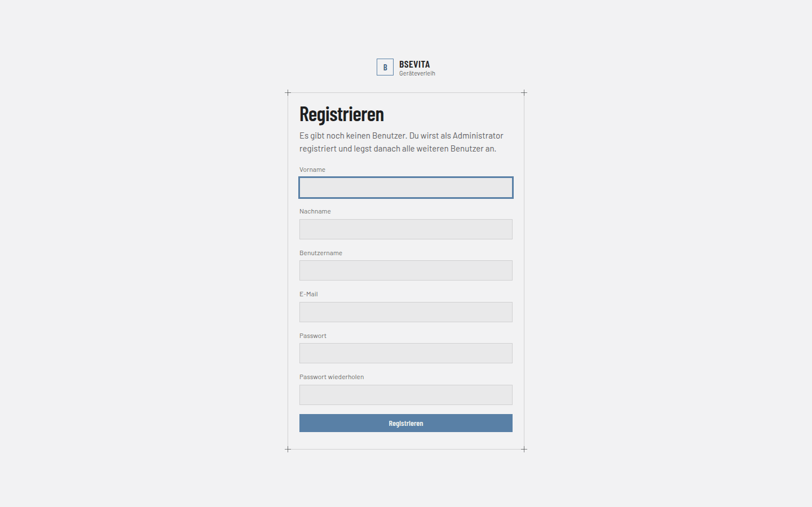

Sobald es einen Benutzer gibt, ist die Registrierung gesperrt. Neue Konten legt dann nur noch ein Admin unter **Benutzer** an (siehe [13.1](#131-benutzer)).

### 3.2 Anmelden und Abmelden

1. Benutzername und Passwort eingeben.
2. **Anmelden** klicken.

Bei falschen Daten erscheint „Benutzername oder Passwort ist falsch.“:

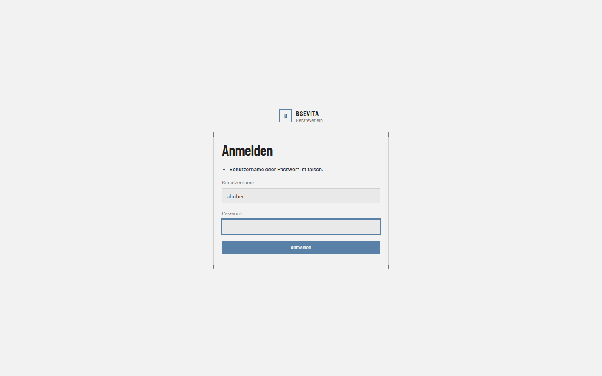

Zum **Abmelden** klicken Sie unten in der Seitenleiste auf das Pfeil-Symbol neben Ihrem Namen (mobil: unter **Profil → Abmelden**).

### 3.3 Aufbau der Oberfläche

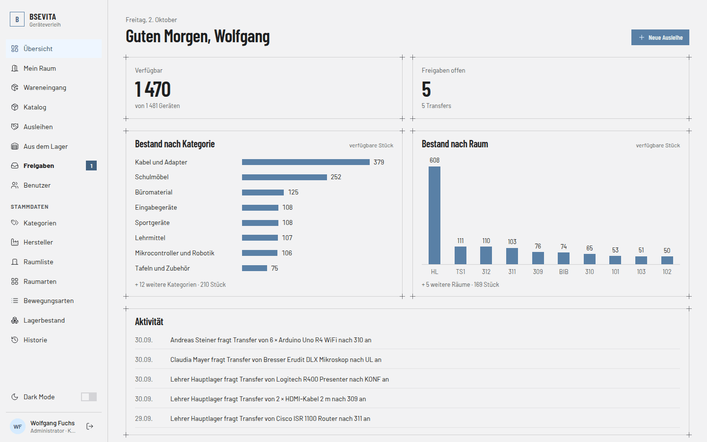

* **Seitenleiste links** (ab ca. 992 px Bildschirmbreite): alle Menüpunkte, die Sie mit Ihrer Rolle und Ihrem Raum sehen dürfen. Der aktuelle Menüpunkt ist hervorgehoben.
* **Badge bei „Freigaben“**: Die Zahl zeigt, wie viele Anfragen auf **Ihre** Freigabe warten. Der Menüpunkt ist dann fett.
* **Stammdaten**: Dieser Abschnitt erscheint nur für Admins.
* **Dark Mode**: Der Schalter unten wechselt zwischen hellem und dunklem Design. Der Browser merkt sich die Wahl. Ohne gespeicherte Wahl gilt die Einstellung des Betriebssystems.
* **Name und Avatar** unten führen zu Ihrem [Profil](#11-profil). Daneben steht Ihre Rolle und gegebenenfalls Ihr Raum (z. B. „Administrator · KONF“).

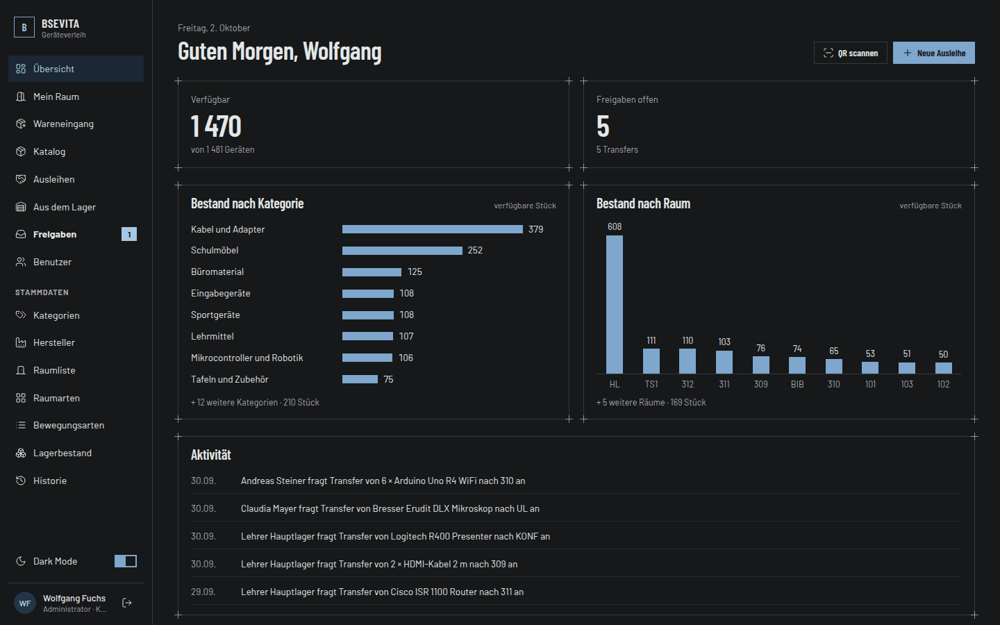

Auf schmalen Bildschirmen (Smartphone) ersetzt eine **Tab-Leiste unten** die Seitenleiste, siehe [Mobile Ansicht](#14-mobile-ansicht).

---

## 4. Übersicht (Startseite)

Die Übersicht ist die Startseite nach der Anmeldung. Oben stehen das Datum und eine Begrüßung je nach Tageszeit, rechts die Schnellzugriffe **QR scannen** und **Neue Ausleihe**.

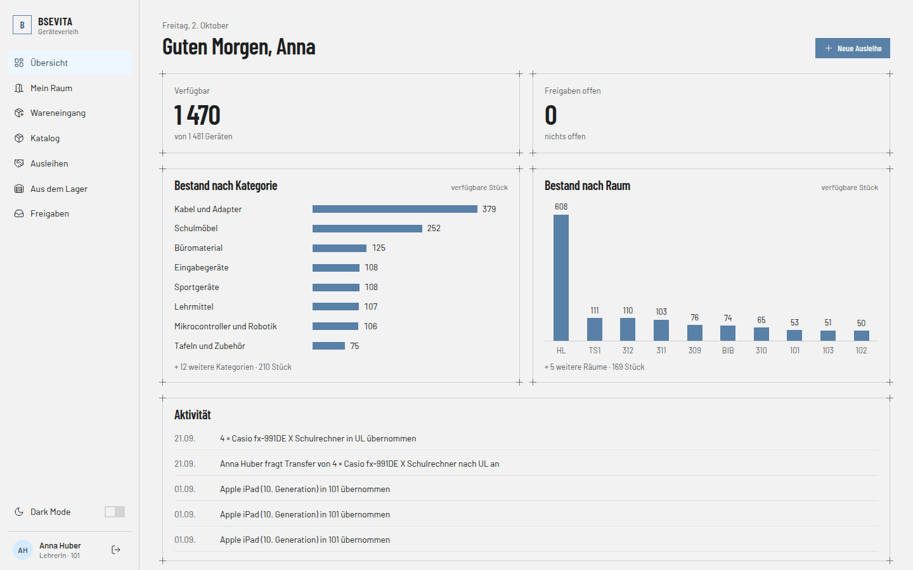

| Bereich | Inhalt |
|---|---|
| **Verfügbar** | Stück, die gerade in Räumen liegen. Darunter „von … Geräten“: das sind alle Stück inklusive derer, die gerade unterwegs sind. |
| **Freigaben offen** | Anzahl offener Transfers. Admins sehen alle, alle anderen nur die für ihren eigenen Raum. |
| **Bestand nach Kategorie** | Balkendiagramm der verfügbaren Stück je Kategorie (die größten acht). Ein **Klick auf einen Balken** öffnet den Katalog, gefiltert nach dieser Kategorie. Beim Darüberfahren zeigt ein Hinweis den Anteil am Gesamtbestand. |
| **Bestand nach Raum** | Säulendiagramm je Raum (die größten zehn). Ein **Klick auf eine Säule** öffnet den Katalog, gefiltert nach diesem Raum. |
| **Aktivität** | Die fünf neuesten Buchungen. Admins sehen alle, alle anderen nur ihre eigenen und die ihres Raums. |

---

## 5. Katalog

Der Katalog listet **alle Gegenstände** mit Seriennummer, Standort, Status und Hinweis (z. B. „unterwegs nach 311“). Ihn sehen alle angemeldeten Personen.

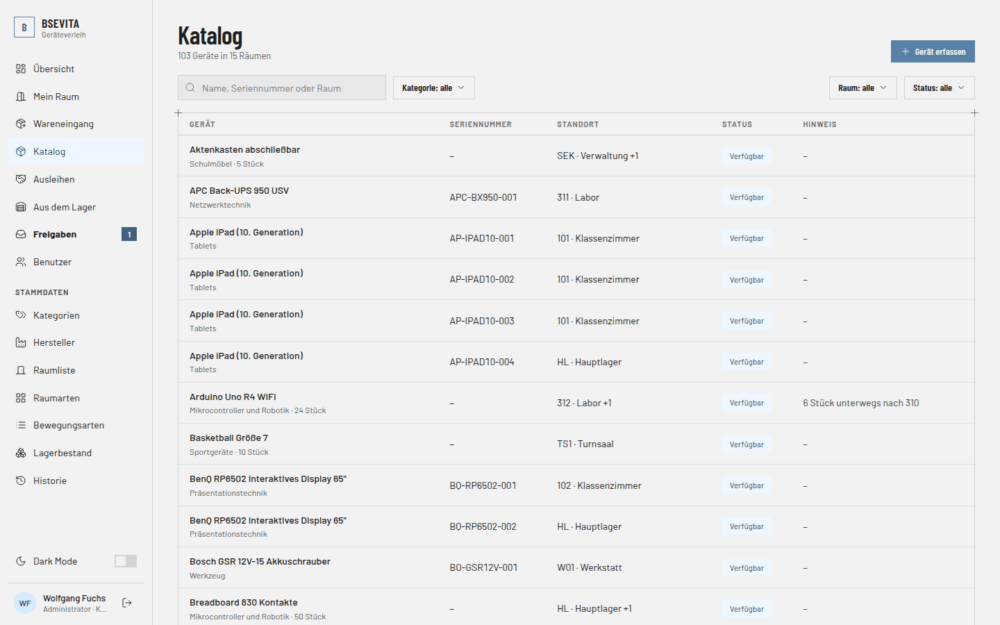

### 5.1 Suchen und filtern

* **Suchfeld**: Name, Seriennummer oder Raum eingeben und mit **Enter** bestätigen.
* **Kategorie**, **Raum** und **Status** filtern sofort bei Auswahl.
* Status-Werte: **Verfügbar** (liegt in einem Raum), **In Transfer** (gerade unterwegs), **Kein Bestand** (im Katalog, aber nirgends gebucht).

Beispiel: alle Geräte, die gerade unterwegs sind:

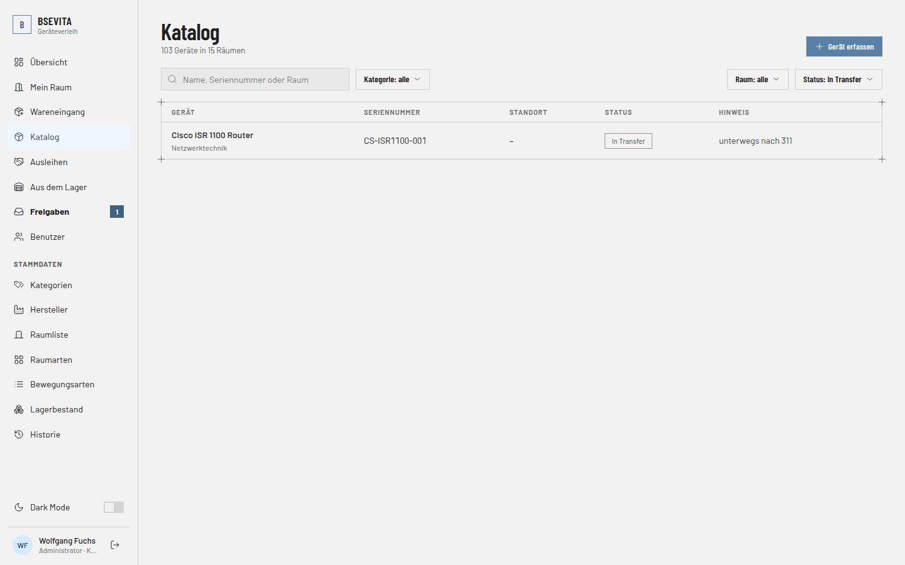

Ein Klick auf eine Zeile öffnet die Details des Gegenstands.

### 5.2 Gegenstand-Details

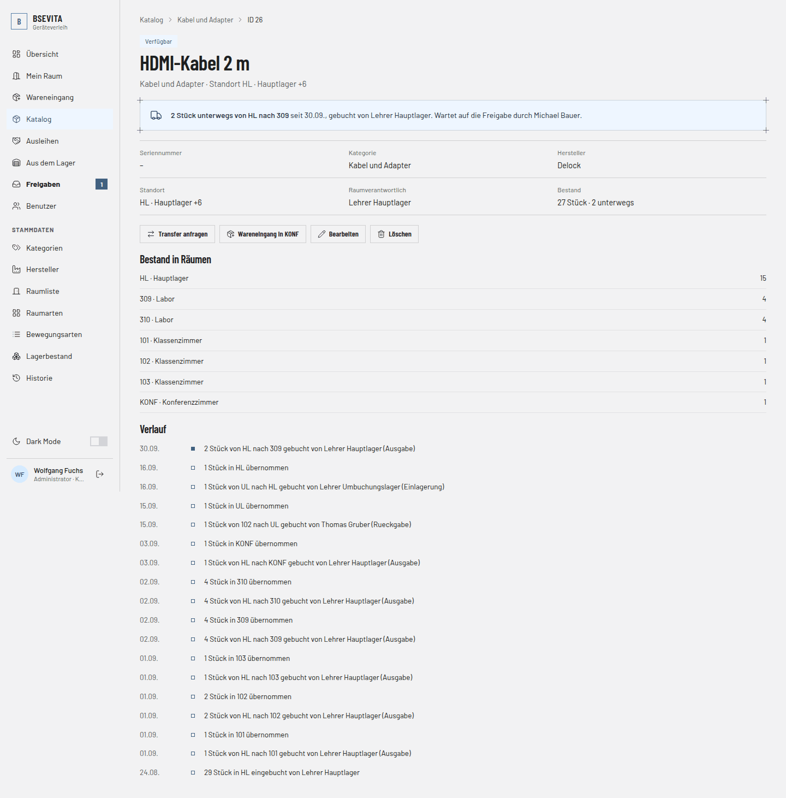

Die Detailseite zeigt:

* **Status** und einen Hinweis, falls gerade etwas unterwegs ist (mit Datum, Buchendem und wer freigeben muss).
* **Seriennummer, Kategorie, Hersteller, Standort, Raumverantwortliche Person, Bestand**.
* **Bestand in Räumen**: Gegenstände ohne Seriennummer können in mehreren Räumen liegen.
* **Verlauf**: alle Buchungen dieses Gegenstands, die neueste zuerst.
* Je nach Berechtigung die Buttons **Transfer anfragen**, **Wareneingang in &lt;Ihr Raum&gt;**, **Freigeben** (wenn Sie eine offene Anfrage freigeben müssen), sowie für Admins **Bearbeiten** und **Löschen**.

> Produktfoto und „Etikett drucken“ sind Platzhalter aus dem Design und haben noch keine Funktion.

### 5.3 Gegenstand erfassen, bearbeiten, löschen (nur Admin)

**Erfassen:** Im Katalog oben rechts auf **Gerät erfassen** klicken.

1. **Bezeichnung** eingeben (Pflicht, max. 100 Zeichen).
2. **Seriennummer** eingeben, wenn es sich um ein einzelnes, eindeutiges Gerät handelt (max. 50 Zeichen, muss eindeutig sein). Leer lassen für Mengenartikel wie Kabel oder Möbel.
3. **Kategorie** und **Hersteller** auswählen.
4. **Anlegen** klicken.

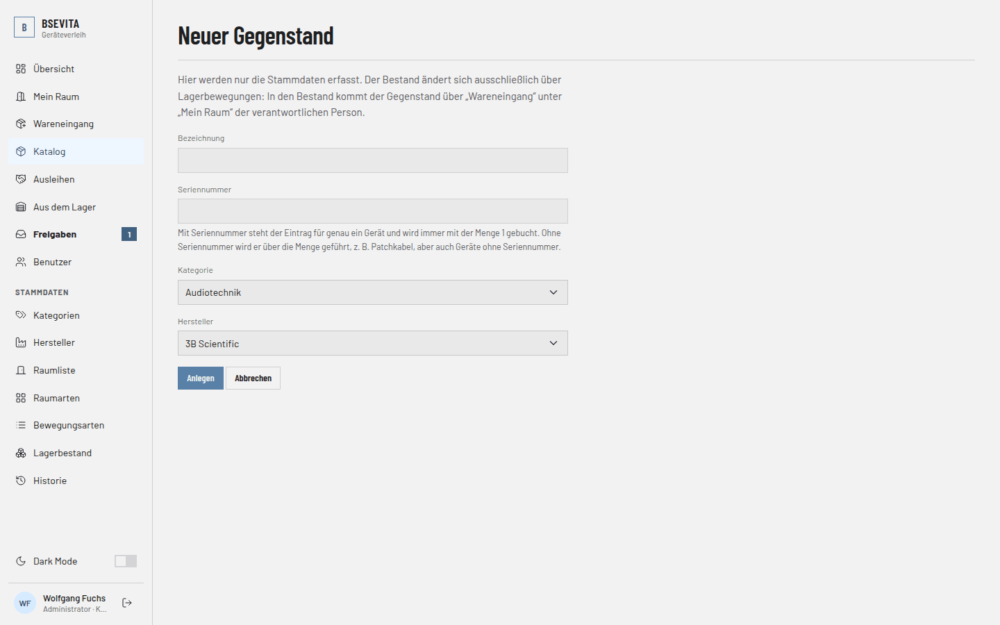

> Hier werden nur die **Stammdaten** erfasst. In den Bestand kommt der Gegenstand erst über einen [Wareneingang](#7-wareneingang) der raumverantwortlichen Person.

**Bearbeiten:** In den Details auf **Bearbeiten** klicken. Ob ein Gegenstand eine Seriennummer hat, lässt sich nur ändern, solange er weder Bestand noch Lagerbewegungen hat.

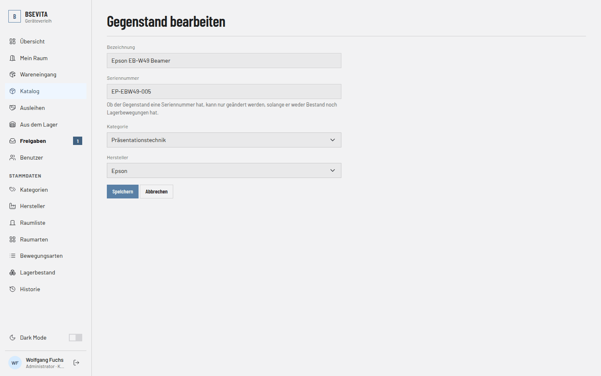

**Löschen:** In den Details auf **Löschen** klicken. Gelöscht werden kann ein Gegenstand nur, wenn er **keinen Bestand** mehr hat und in **keiner Lagerbewegung** vorkommt (sonst ginge die Historie verloren). Andernfalls erklärt die Seite, warum es nicht geht:

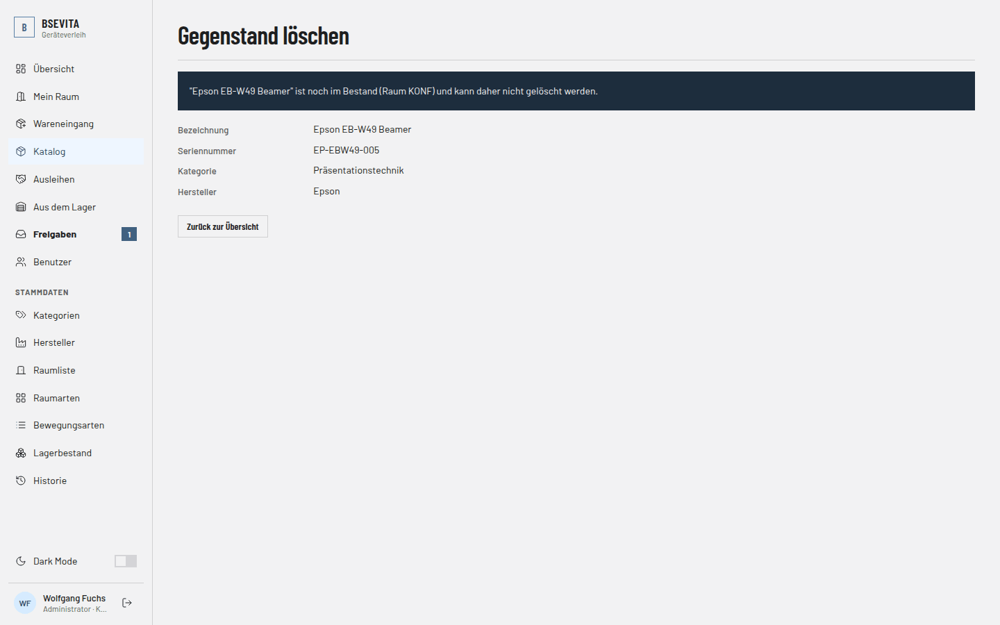

> Der Button „CSV importieren“ im Katalog ist ein Platzhalter aus dem Design. Einen CSV-Import gibt es noch nicht.

---

## 6. Mein Raum

*Nur für Personen mit eigenem Raum.* Hier sehen Sie alles zu dem Raum, für den Sie verantwortlich sind.

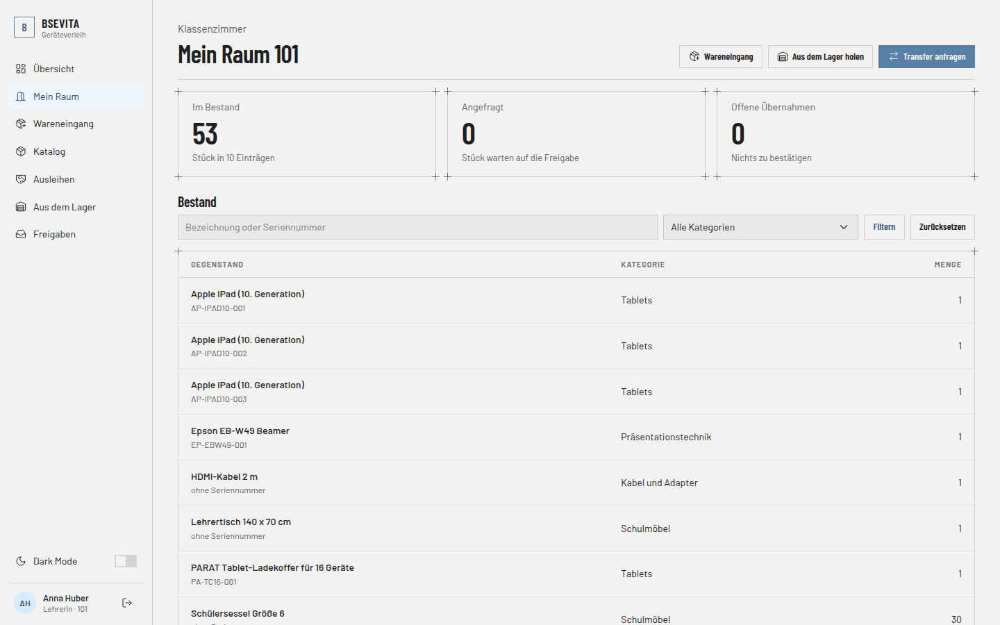

* Oben rechts die Aktionen **Wareneingang**, **Aus dem Lager holen** und **Transfer anfragen**.
* **Im Bestand**: Stück und Anzahl der Einträge im Raum.
* **Angefragt**: Stück, die Sie aus dem Raum abgegeben oder aus einem Lager angefragt haben und die noch auf die Freigabe warten.
* **Offene Übernahmen**: Anfragen, die **Sie** freigeben müssen, mit dem Link **Jetzt bestätigen**.
* **Bestand**: Tabelle aller Gegenstände im Raum. Mit Suchfeld und Kategorie-Auswahl filtern Sie, **Zurücksetzen** hebt den Filter auf.

Sobald Anfragen offen sind, erscheint zusätzlich die Tabelle **„Angefragt, noch nicht freigegeben“**:

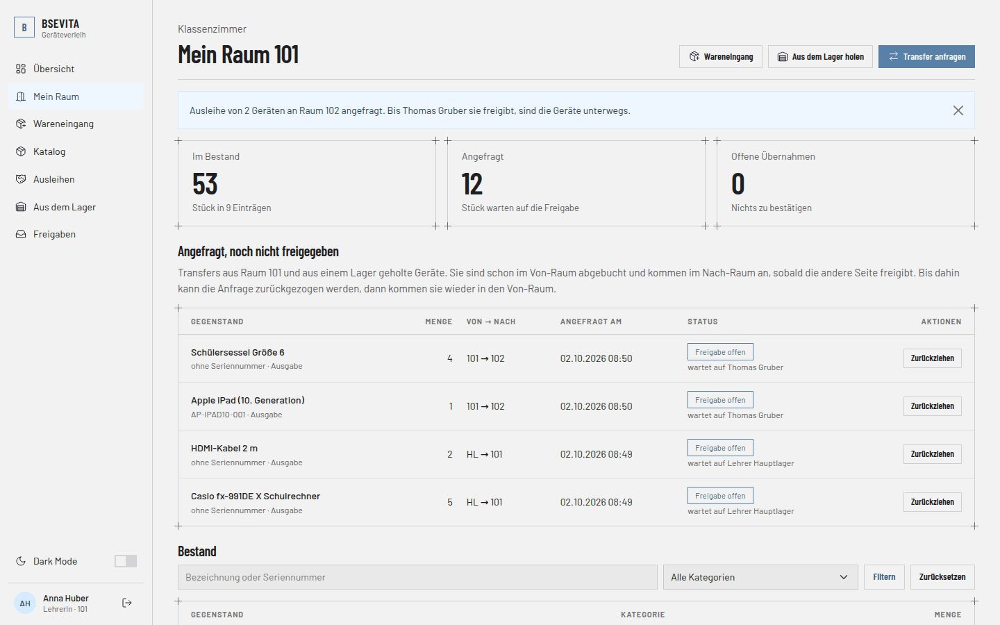

Die Mengen sind bereits im Von-Raum abgebucht und kommen im Nach-Raum an, sobald die andere Seite freigibt. Bis dahin können Sie eine Anfrage mit **Zurückziehen** rückgängig machen. Nach einer Sicherheitsabfrage kommt die Menge wieder in den Von-Raum, und die Bewegung bleibt als „Storniert“ in der Historie.

---

## 7. Wareneingang

*Nur für Personen mit eigenem Raum.* Mit dem Wareneingang kommen **neue Gegenstände von außen** (z. B. nach einer Lieferung) in den Bestand Ihres Raums.

1. Menüpunkt **Wareneingang** öffnen (oder in den Gegenstand-Details **Wareneingang in &lt;Raum&gt;** klicken, dann ist der Gegenstand schon ausgewählt).
2. **Gegenstand** auswählen. Geräte mit Seriennummer, die schon in einem Raum liegen oder unterwegs sind, fehlen in der Liste.
3. **Menge** eingeben (bei Geräten mit Seriennummer immer 1).
4. **Bewegungsart** prüfen (vorausgewählt: „Wareneingang“).
5. **Einbuchen** klicken.

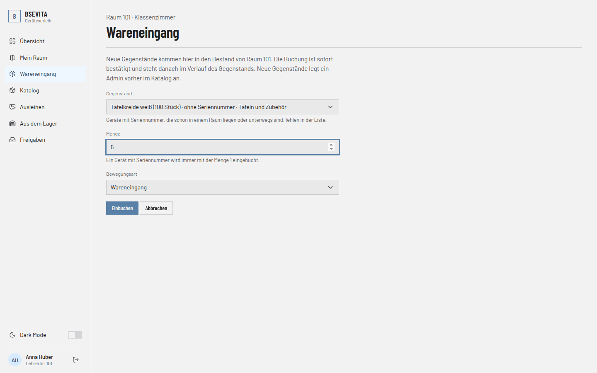

Die Buchung ist **sofort bestätigt**, eine Freigabe ist nicht nötig. Danach erscheint eine Bestätigung unter „Mein Raum“:

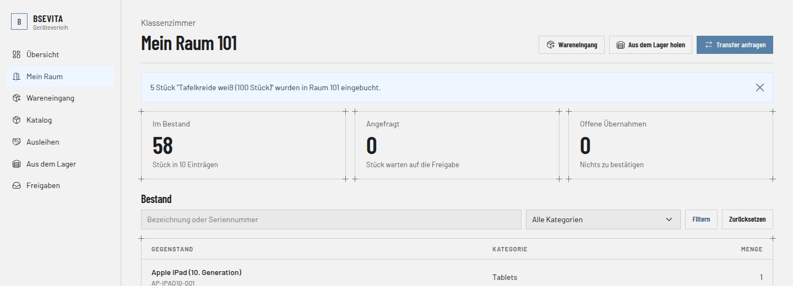

> Gibt es den Gegenstand noch nicht im Katalog, muss ihn zuerst ein Admin [erfassen](#53-gegenstand-erfassen-bearbeiten-löschen-nur-admin).

---

## 8. Aus dem Lager holen

*Nur für Personen mit eigenem Raum.* Hier fordern Sie Geräte aus einem Lager (Hauptlager **HL** oder Umbuchungslager **UL**) für Ihren eigenen Raum an.

1. Menüpunkt **Aus dem Lager** öffnen.
2. Oben das **Lager** anklicken (bei jeder Karte steht, wer freigibt).

   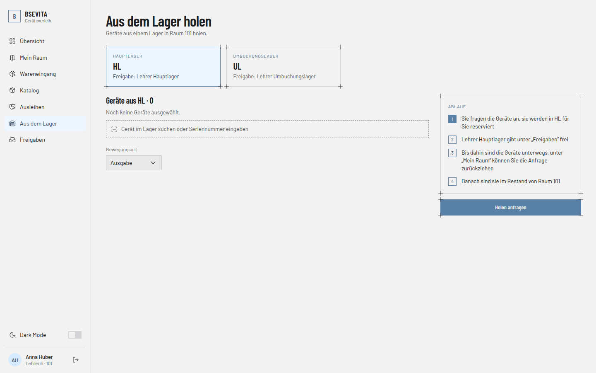

3. Im Suchfeld Name oder Seriennummer eingeben (oder scannen). Ein Klick auf einen Vorschlag fügt das Gerät hinzu, **Enter** übernimmt den ersten Vorschlag.
4. Bei Mengenartikeln die **Menge** eintragen (rechts steht „von …“, also wie viel im Lager liegt). Mit **×** entfernen Sie ein Gerät wieder aus der Liste.
5. **Bewegungsart** wählen (Standard: „Ausgabe“).
6. **Holen anfragen** klicken.

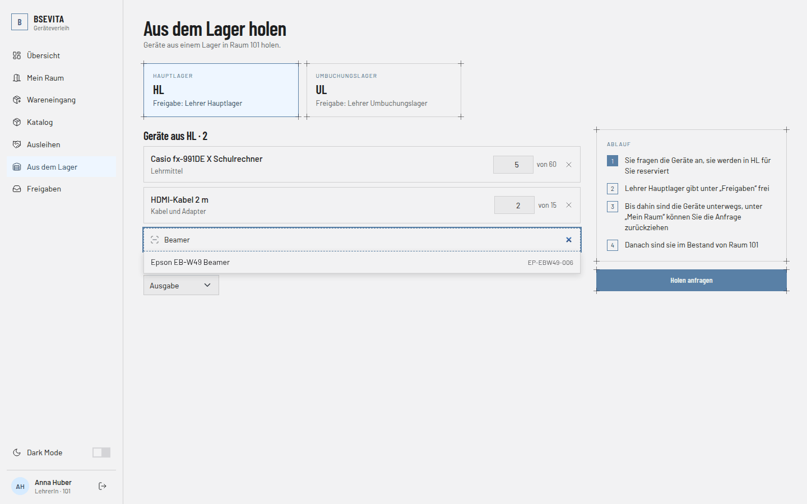

Der Kasten **Ablauf** rechts fasst zusammen, was danach passiert:

1. Die Geräte werden sofort im Lager abgebucht (für Sie reserviert).
2. Die verantwortliche Person des Lagers gibt unter **Freigaben** frei.
3. Bis dahin sind die Geräte unterwegs. Unter **Mein Raum** können Sie die Anfrage zurückziehen.
4. Nach der Freigabe sind die Geräte im Bestand Ihres Raums.

Alle Positionen werden **gemeinsam** gebucht: Ist eine Menge ungültig, wird gar nichts gebucht und eine Fehlermeldung erklärt den Grund.

---

## 9. Ausleihen (Transfer anfragen)

Mit **Ausleihen** (bzw. **Transfer anfragen** unter „Mein Raum“ oder **Neue Ausleihe** auf der Übersicht) geben Sie Geräte **aus Ihrem Raum an einen anderen Raum** weiter.

1. Bei **Ausleihen an** den Zielraum wählen. Angeboten werden nur Räume mit verantwortlicher Person, denn diese muss die Übernahme bestätigen.
2. **Bewegungsart** wählen (Standard: „Ausgabe“, z. B. auch „Rueckgabe“ oder „Reparatur“).
3. Geräte über das Suchfeld hinzufügen (Name/Seriennummer eintippen oder scannen, Vorschlag anklicken).
4. Bei Mengenartikeln die **Menge** eintragen. Geräte mit Seriennummer werden immer einzeln gebucht.
5. Rechts in der **Zusammenfassung** prüfen: Von, An und **Benötigte Freigabe** (wer bestätigen muss).
6. **Freigabe anfragen** klicken.

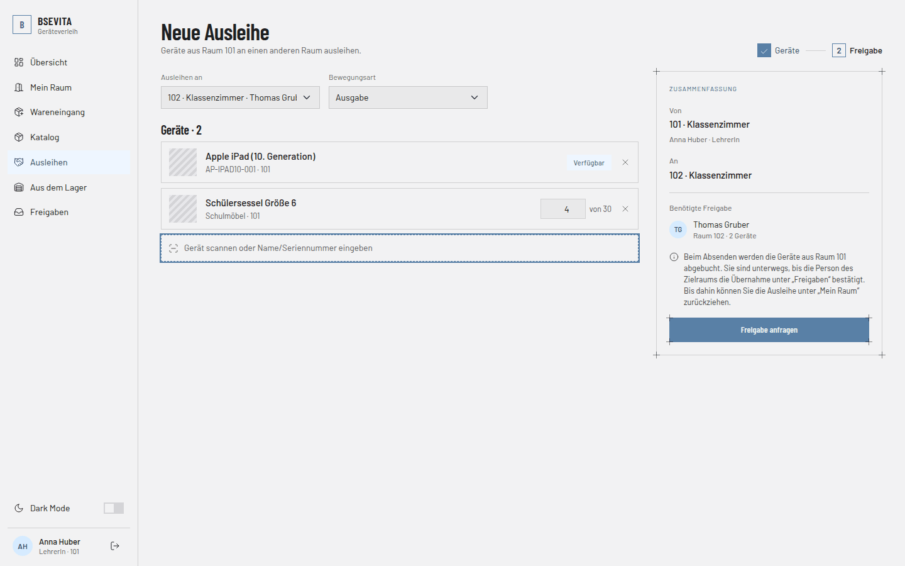

Die Schritte oben rechts (**1 Geräte → 2 Freigabe**) zeigen den Fortschritt. Nach dem Absenden landen Sie unter „Mein Raum“ mit einer Bestätigung, z. B. „Ausleihe von 2 Geräten an Raum 102 angefragt. Bis Thomas Gruber sie freigibt, sind die Geräte unterwegs.“

> Wer für **keinen Raum** verantwortlich ist, sieht auf dieser Seite nur einen Hinweis, denn nur die verantwortliche Person darf Gegenstände aus einem Raum buchen.

---

## 10. Freigaben

*Nur für Personen mit eigenem Raum.* Hier bestätigen Sie Anfragen, die **Sie** freigeben müssen:

* **Transfers in Ihren Raum** (jemand leiht Ihnen etwas aus), und
* **Geräte, die jemand aus Ihrem Lager holt** (wenn Sie für HL oder UL verantwortlich sind).

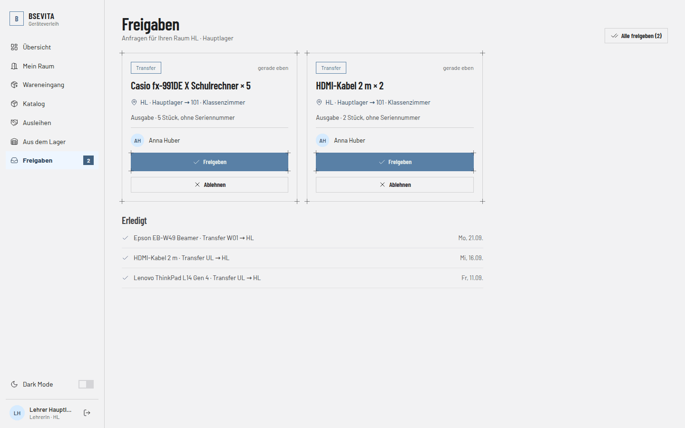

Jede Anfrage ist eine Karte mit Gegenstand, Menge, Von → Nach, Bewegungsart und der Person, die angefragt hat.

* **Freigeben**: Die Menge wird im Nach-Raum zugebucht, die Lagerbewegung ist bestätigt.
* **Ablehnen**: Nach einer Sicherheitsabfrage geht die Menge zurück in den Von-Raum, die Bewegung wird „Storniert“.
* **Alle freigeben (n)** oben rechts bestätigt alle offenen Anfragen auf einmal.

Nach dem Freigeben erscheint eine Bestätigung, und die Anfragen wandern in die Liste **Erledigt**:

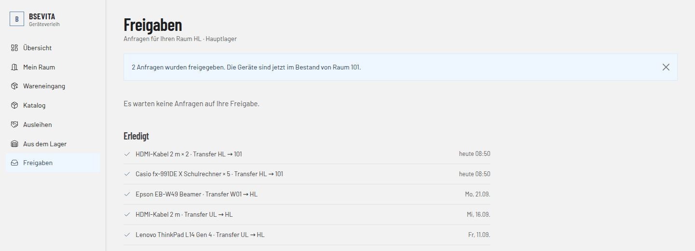

Beispiel aus Sicht des Zielraums 102: Thomas Gruber hat zwei Anfragen von Anna Huber (Raum 101) …

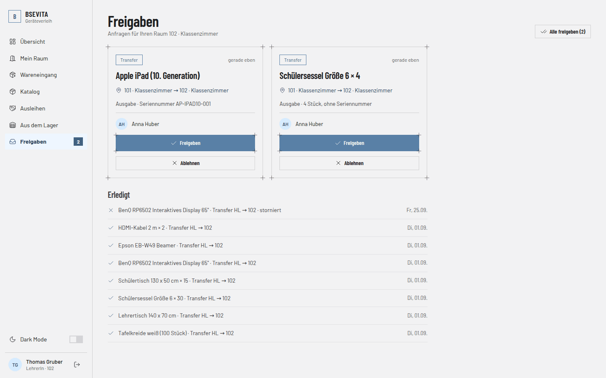

… und lehnt die Schülersessel ab. Sie sind sofort wieder im Bestand von Raum 101, die Ablehnung steht unter „Erledigt“ als *storniert*:

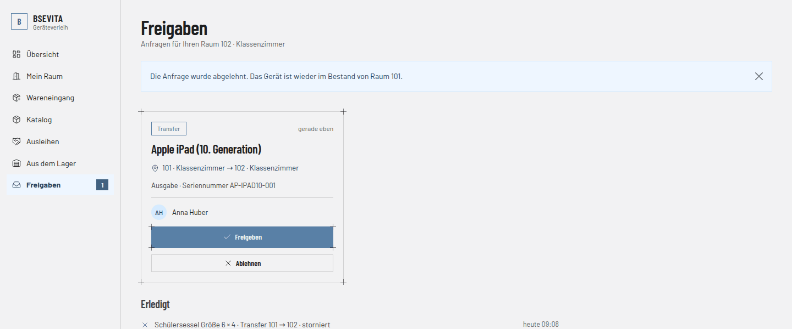

### Lebenszyklus einer Lagerbewegung

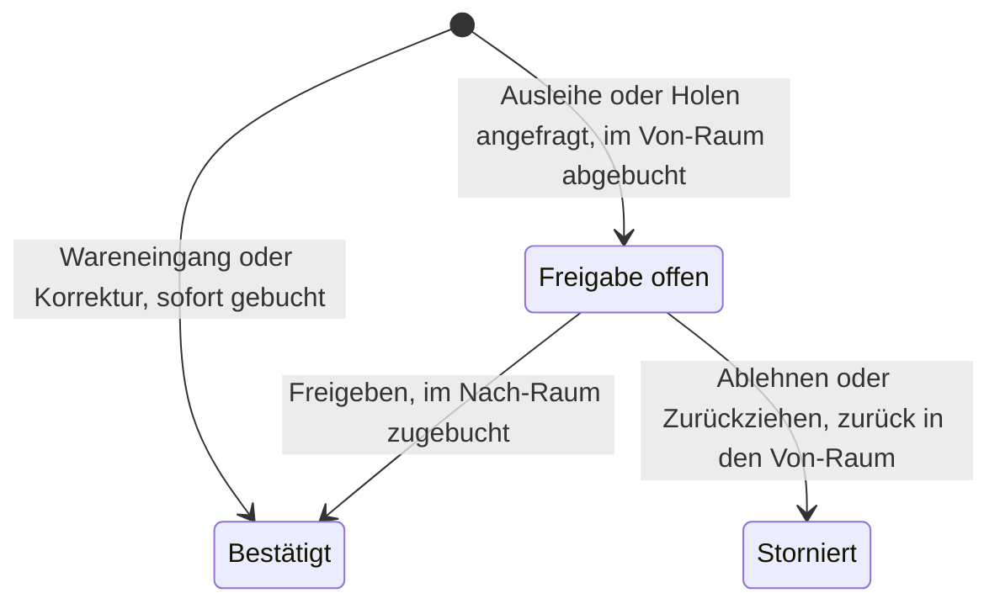
```mermaid
stateDiagram-v2
    state "Freigabe offen" as Offen
    state "Bestätigt" as Bestaetigt
    state "Storniert" as Storniert
    [*] --> Offen: Ausleihe oder Holen angefragt, im Von-Raum abgebucht
    Offen --> Bestaetigt: Freigeben, im Nach-Raum zugebucht
    Offen --> Storniert: Ablehnen oder Zurückziehen, zurück in den Von-Raum
    [*] --> Bestaetigt: Wareneingang oder Korrektur, sofort gebucht
```

| Wer? | Transfer / Ausleihe aus Raum A nach Raum B | Holen aus Lager L in Raum R |
|---|---|---|
| Anfragen | verantwortliche Person von **A** | verantwortliche Person von **R** |
| Freigeben / Ablehnen | verantwortliche Person von **B** | verantwortliche Person von **L** |
| Zurückziehen | verantwortliche Person von **A** | verantwortliche Person von **R** |

---

## 11. Profil

Ein Klick auf Ihren Namen unten in der Seitenleiste öffnet Ihr Profil.

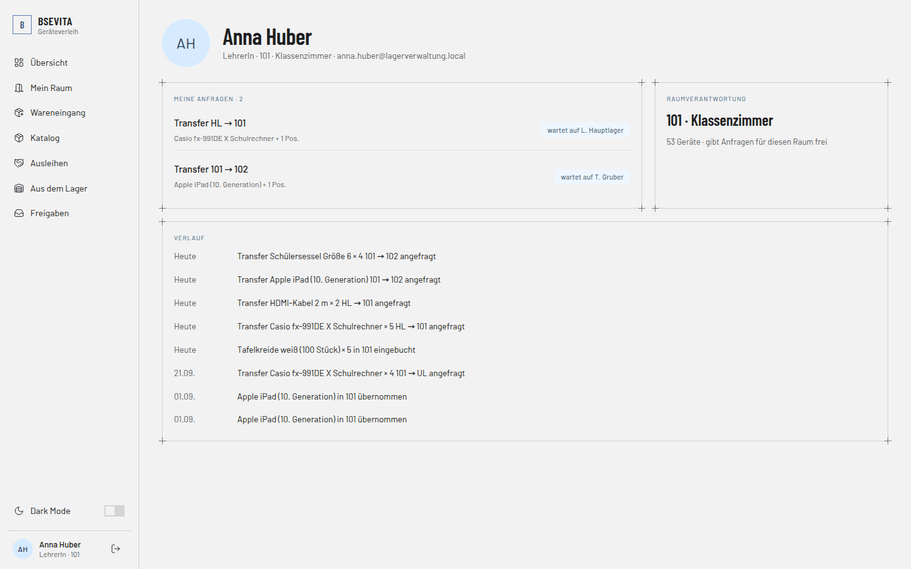

* **Kopf**: Name, Rolle, Raum und E-Mail.
* **Meine Anfragen**: Ihre offenen Anfragen und auf wen sie warten.
* **Raumverantwortung**: Ihr Raum mit Anzahl der Geräte.
* **Verlauf**: Ihre letzten Buchungen.

Admins können über die Benutzerverwaltung auch das Profil **anderer Personen** öffnen. Dort gibt es zusätzlich **Rolle ändern** und **Löschen** (das eigene Konto kann man nicht löschen):

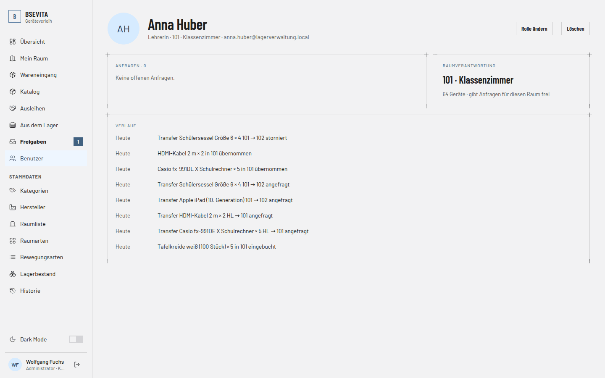

---

## 12. Scannen

Über **QR scannen** (Übersicht) bzw. den Tab **Scannen** (mobil) erreichen Sie die Scan-Seite.

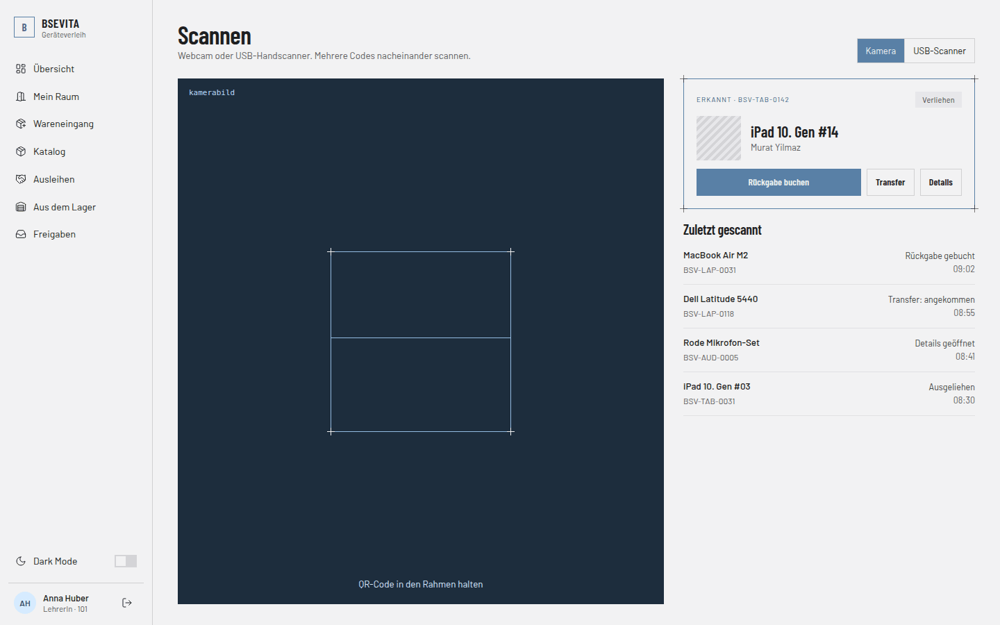

> Die Seite ist derzeit eine **statische Vorschau** aus dem Design und hat noch keine Funktion. Zum Hinzufügen von Geräten können Sie aber in den Suchfeldern von „Ausleihen“ und „Aus dem Lager holen“ einen USB-Handscanner verwenden: Er tippt die Seriennummer ein, und **Enter** übernimmt den ersten Vorschlag.

---

## 13. Administration

Alle Seiten in diesem Abschnitt sind **nur für Admins** sichtbar.

### 13.1 Benutzer

Menüpunkt **Benutzer**: links die Liste aller Benutzer mit Rolle, Raumverantwortung und Anzahl offener Transfers, rechts die Details der ausgewählten Person.

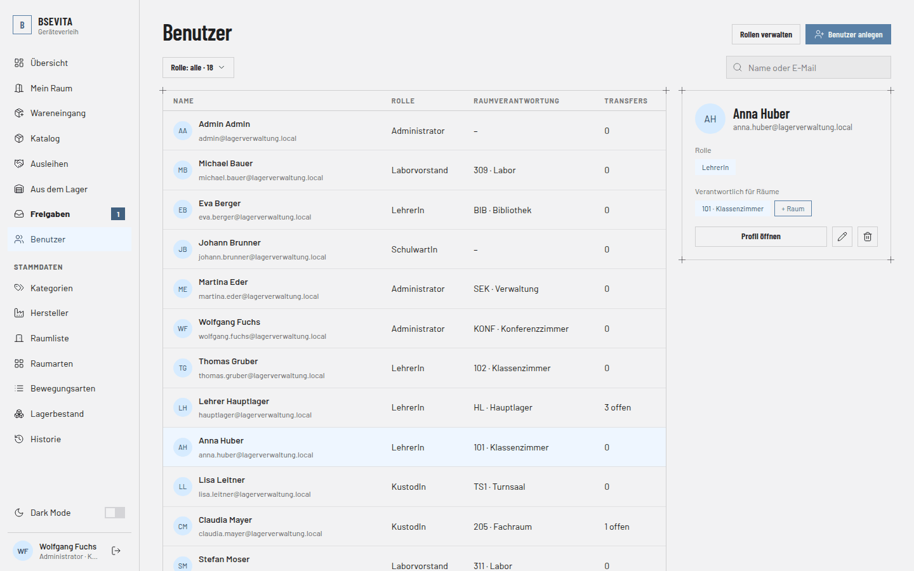

* **Rolle: alle** filtert die Liste nach Rolle, das Suchfeld rechts sucht nach Name oder E-Mail (mit Enter).
* Ein **Klick auf eine Zeile** zeigt die Person rechts. Dort gibt es **Profil öffnen**, **Bearbeiten** (Stift) und **Löschen** (Papierkorb).
* **+ Raum** führt zur Raumliste, denn die Raumverantwortung legt man beim Raum fest (siehe [13.2](#132-stammdaten)).

**Benutzer anlegen:** Oben rechts auf **Benutzer anlegen** klicken, Vorname, Nachname, Benutzername (eindeutig), Passwort, E-Mail und Rolle eintragen, dann **Anlegen** klicken.

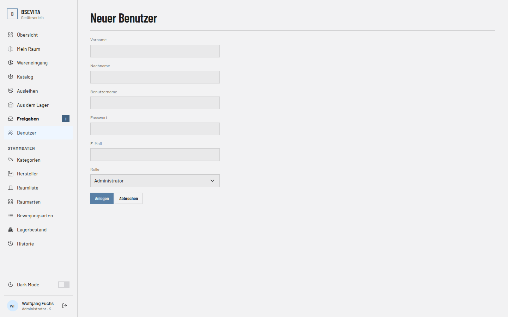

**Benutzer bearbeiten:** Bleibt das Feld **Neues Passwort** leer, behält die Person ihr bisheriges Passwort. So setzen Sie auch vergessene Passwörter zurück.

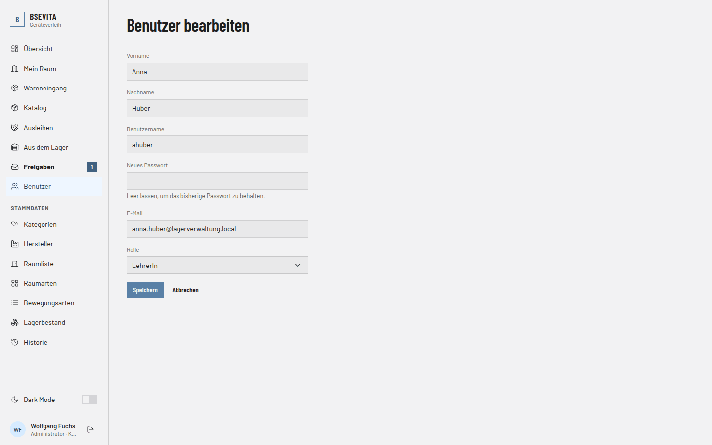

**Regeln beim Bearbeiten und Löschen:**

* Der **letzte Administrator** muss eine Admin-Rolle behalten und kann nicht gelöscht werden.
* Das **eigene Konto** kann man nicht löschen.
* Eine Person, die für einen **Raum verantwortlich** ist, kann erst gelöscht werden, wenn der Raum einer anderen Person zugewiesen ist.
* Eine Person, die **Lagerbewegungen erfasst** hat, kann nicht gelöscht werden (die Historie muss nachvollziehbar bleiben).

**Rollen verwalten:** Über **Rollen verwalten** (oben rechts) legen Sie Rollen an, bearbeiten oder löschen sie. Ist bei einer Rolle **Admin** angehakt, bekommen alle Personen mit dieser Rolle Zugriff auf die Administration.

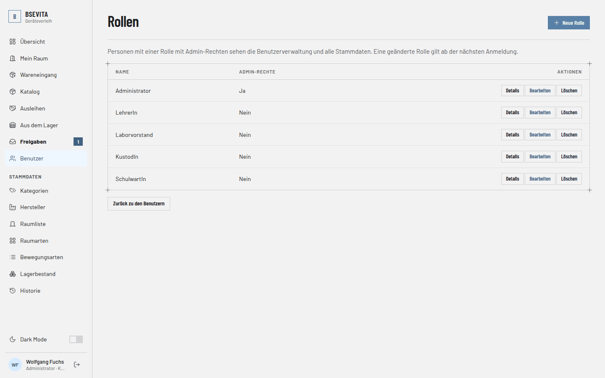

> Die Rolle wird beim Anmelden übernommen. Ändert ein Admin die Rolle einer Person, gilt die neue Rolle erst, wenn sich diese Person ab- und wieder anmeldet. Eine geänderte **Raumverantwortung** gilt dagegen sofort.

### 13.2 Stammdaten

Alle Stammdaten-Seiten funktionieren gleich: eine Liste mit **Neu**-Button oben rechts und je Zeile **Details**, **Bearbeiten** und **Löschen**.

#### Kategorien

Die Liste zeigt jede Kategorie mit der Anzahl ihrer Gegenstände.

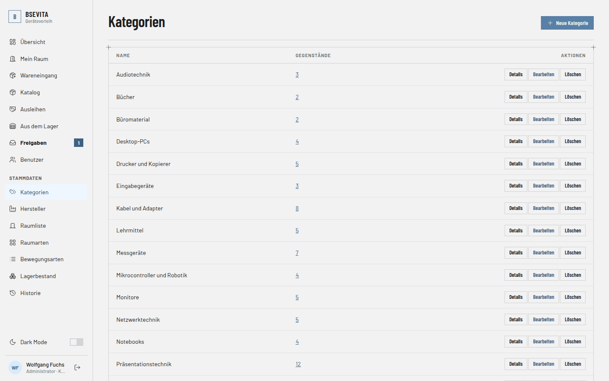

**Neue Kategorie** öffnet ein Formular mit nur einem Feld (Name). Die Formulare für Hersteller, Raumarten und Bewegungsarten sehen genauso aus:

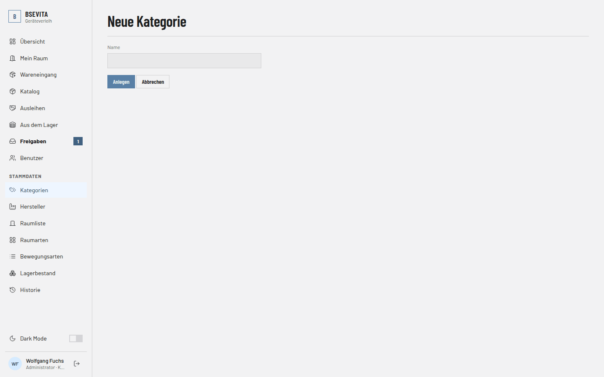

* Jeder Name darf nur einmal vorkommen („Diese Kategorie gibt es bereits.“).
* Eine Kategorie kann nur gelöscht werden, wenn ihr **keine Gegenstände** mehr zugeordnet sind.

#### Hersteller

Funktioniert wie die Kategorien: Name eindeutig, Löschen nur ohne zugeordnete Gegenstände.

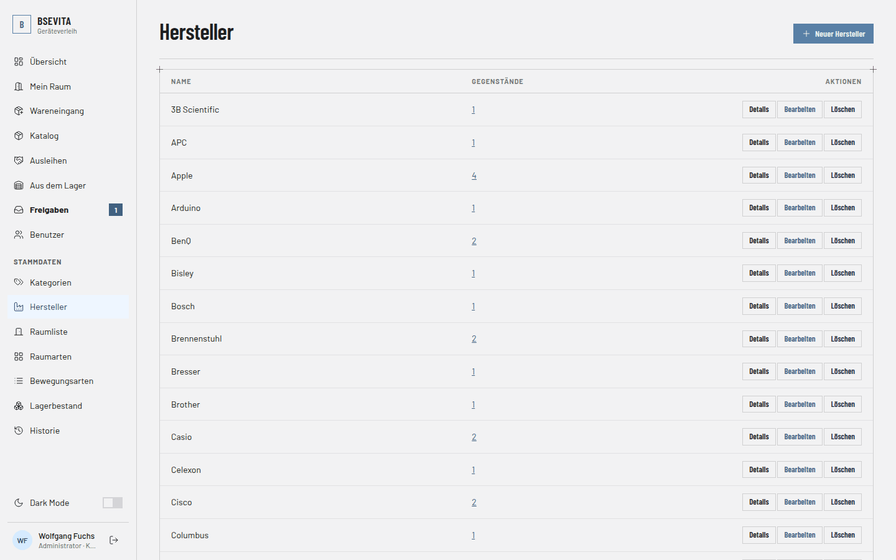

#### Raumliste

Menüpunkt **Raumliste**: alle Räume mit Raumart und verantwortlicher Person.

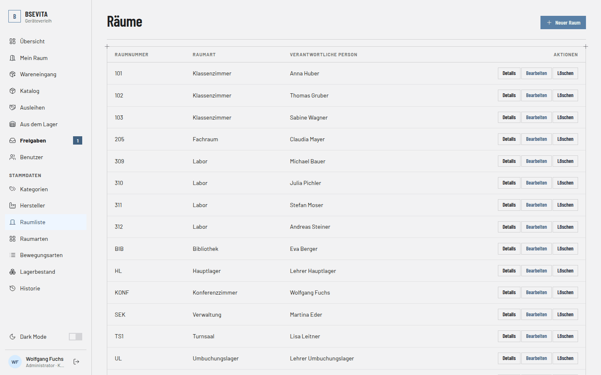

**Neuer Raum:**

1. **Raumnummer** eingeben (max. 8 Zeichen, nur Buchstaben, Ziffern, Punkt, Binde- und Unterstrich). Sie **kann später nicht mehr geändert werden**.
2. **Raumart** auswählen.
3. **Verantwortliche Person** auswählen. Angeboten werden nur Personen, die noch keinen Raum haben.

**Raum bearbeiten:** Hier ändern Sie Raumart und verantwortliche Person. Eine neue Person ist **ab sofort zuständig**, auch für schon offene Lagerbewegungen. Ohne verantwortliche Person kann nichts aus diesem Raum gebucht werden, und offene Bewegungen in diesen Raum bleiben offen, bis wieder jemand zugewiesen ist.

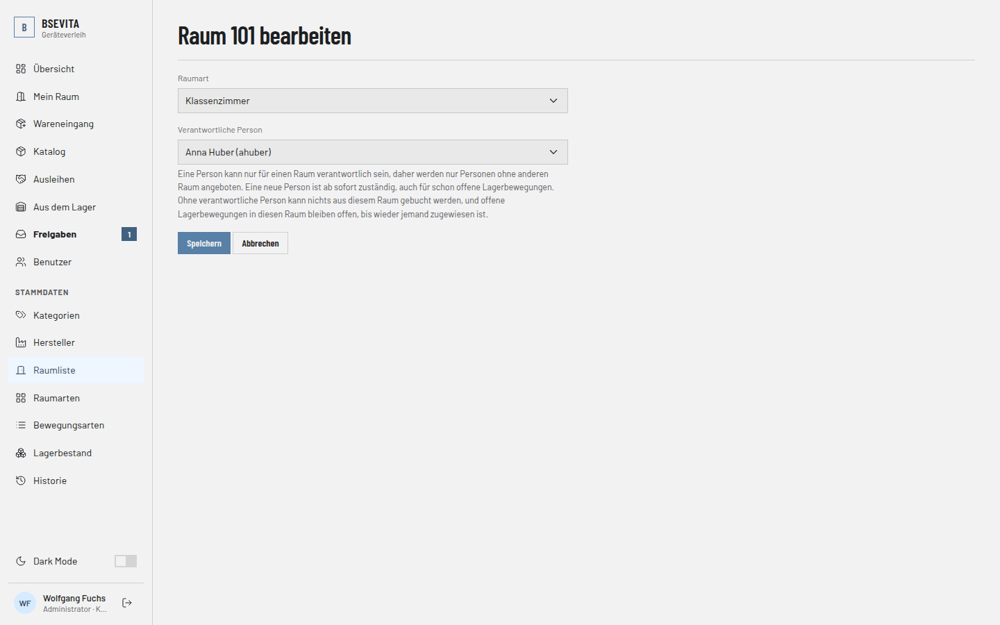

**Raum löschen** geht nur, wenn der Raum **leer** ist und in **keiner Lagerbewegung** vorkommt.

#### Raumarten

Eine Raumart beschreibt einen Raum nur näher (z. B. Labor). Wer buchen und bestätigen darf, hängt **nicht** von der Raumart ab, sondern nur von der verantwortlichen Person. Einzige Besonderheit: Räume, deren Raumart „lager“ im Namen trägt (z. B. *Hauptlager*, *Umbuchungslager*), erscheinen unter [Aus dem Lager holen](#8-aus-dem-lager-holen).

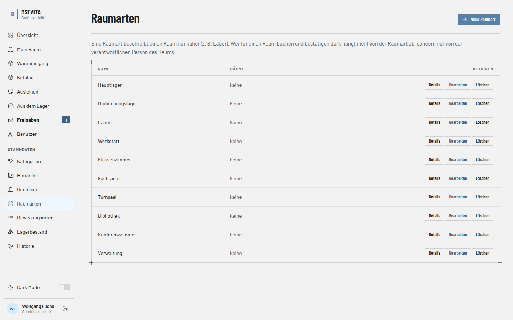

#### Bewegungsarten

Eine Bewegungsart beschreibt eine Lagerbewegung nur näher (z. B. Ausgabe, Rückgabe, Reparatur) und gibt keine Regeln für den Ablauf vor.

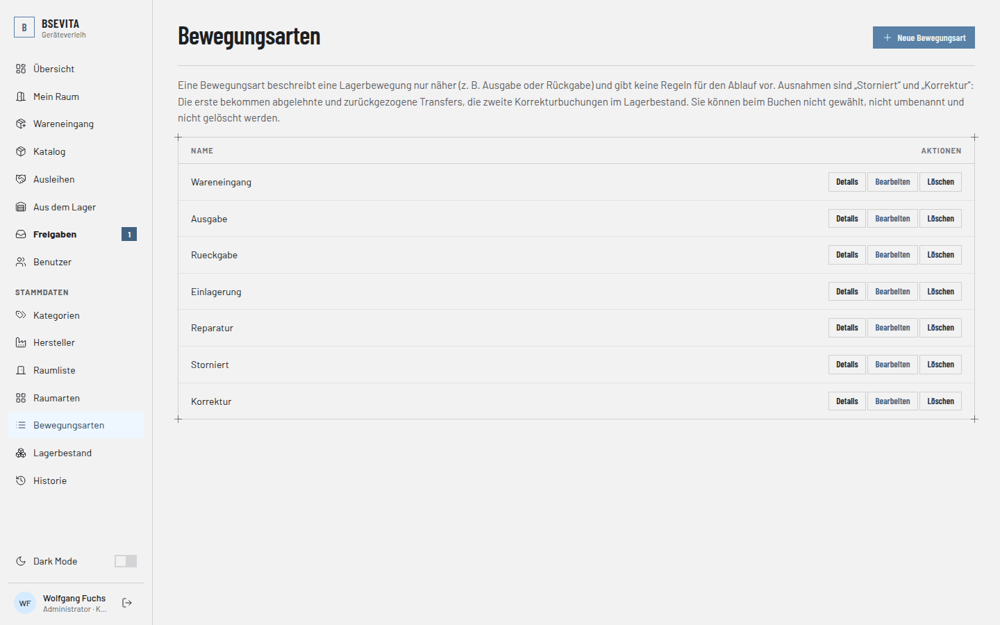

> **Ausnahmen:** „Storniert“ (für abgelehnte und zurückgezogene Transfers) und „Korrektur“ (für Korrekturbuchungen im Lagerbestand) vergibt die App selbst. Sie können beim Buchen nicht gewählt, nicht umbenannt und nicht gelöscht werden.

### 13.3 Lagerbestand (Korrektur)

Mit **Lagerbestand** korrigieren Admins den Bestand eines Raums, z. B. nach einer Inventur.

1. Oben den **Raum** auswählen. Die Seite lädt sofort den Bestand dieses Raums.
2. In der Spalte **Neue Menge** die gezählte Menge eintragen. Geräte mit Seriennummer sind entweder da (1) oder nicht (0).
3. Fehlt ein Gegenstand im Raum, wählen Sie ihn unter **Gegenstand hinzufügen** aus und geben die Menge ein.
4. **Korrektur buchen** klicken. **Zurücksetzen** verwirft die Eingaben.

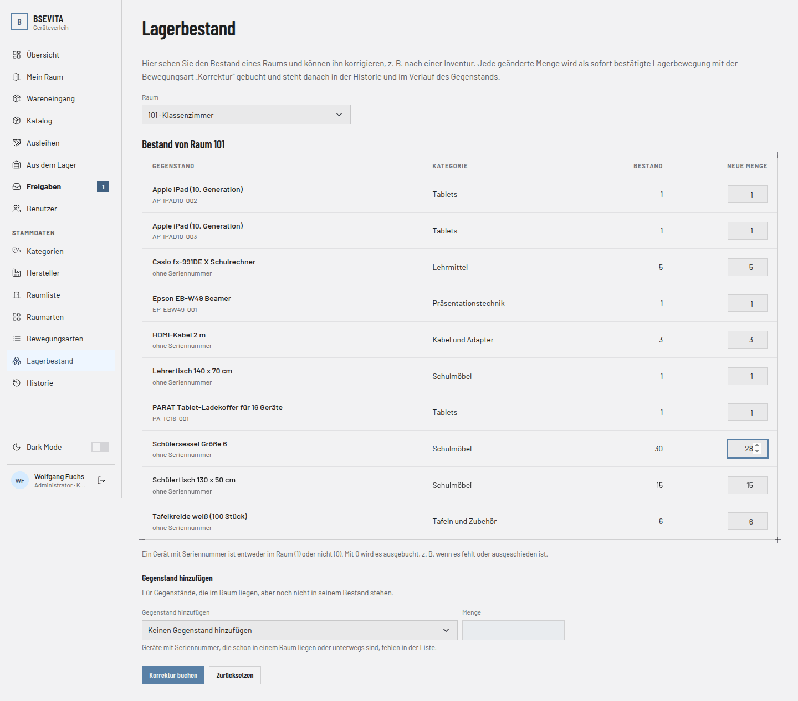

Jede geänderte Menge wird als **sofort bestätigte Lagerbewegung** mit der Bewegungsart „Korrektur“ gebucht und erscheint in der Historie (die Menge ist dort die Änderung, z. B. −2).

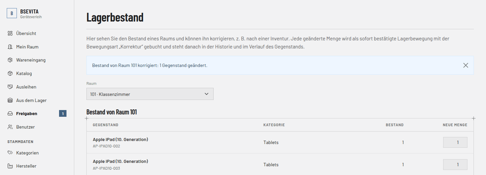

> Hat sich der Bestand zwischen Anzeigen und Buchen geändert (z. B. durch einen Transfer), bricht die Korrektur ab. Dann die Seite neu laden und neu zählen.

### 13.4 Historie

Die **Historie** listet **alle Lagerbewegungen**, die neueste zuerst, mit 50 Einträgen pro Seite.

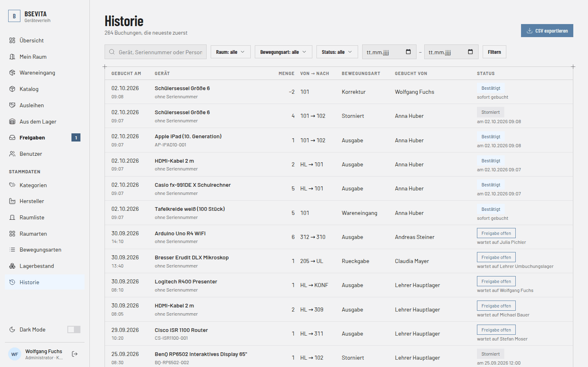

Spalten: gebucht am, Gerät, Menge, Von → Nach, Bewegungsart, gebucht von und Status:

* **Freigabe offen** mit „wartet auf …“,
* **Bestätigt** mit Zeitpunkt („sofort gebucht“ bei Wareneingang und Korrektur),
* **Storniert** mit Zeitpunkt der Stornierung.

**Filtern:** Suchfeld (Gerät, Seriennummer oder Person), **Raum**, **Bewegungsart**, **Status** und ein **Zeitraum** (von – bis). Dann **Filtern** klicken. **×** setzt alle Filter zurück. Beispiel: alle offenen Freigaben im September:

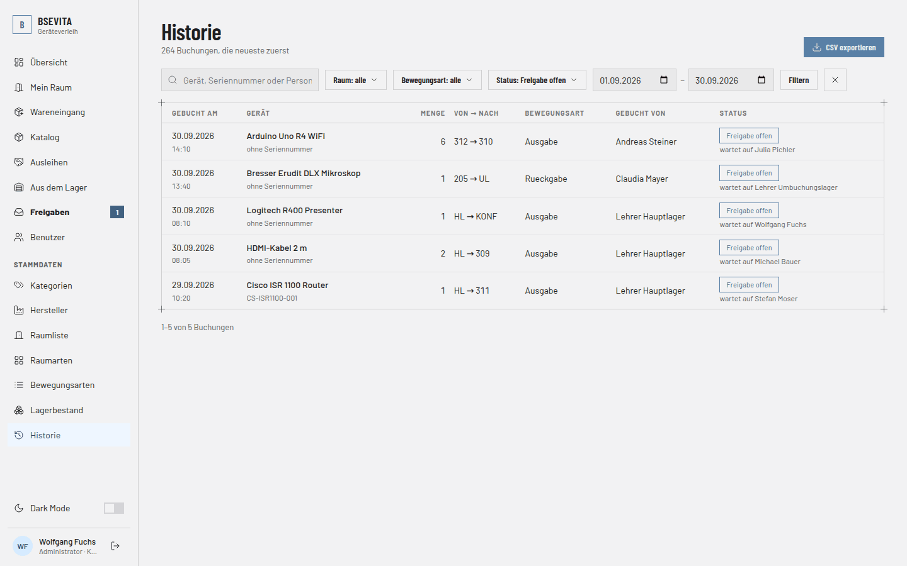

Ein Klick auf eine Zeile öffnet die Details des Gegenstands mit seinem Verlauf.

**CSV exportieren** lädt **alle** Lagerbewegungen (unabhängig vom Filter, älteste zuerst) als Datei `Lagerbewegungen_JJJJ-MM-TT.csv` herunter. Die Datei ist mit Strichpunkt getrennt und UTF-8-kodiert, sodass Excel mit deutschen Einstellungen Spalten und Umlaute richtig erkennt. Spalten: *Gebucht am; Abgeschlossen am; Status; Bewegungsart; Gegenstand; Seriennummer; Menge; Von Raum; Nach Raum; Gebucht von*.

---

## 14. Mobile Ansicht

Auf dem Smartphone passt sich die App an: Statt der Seitenleiste gibt es unten eine **Tab-Leiste** mit **Übersicht**, **Katalog**, **Scannen** (hervorgehoben in der Mitte), **Freigaben** (mit Badge) und **Profil**. Alle weiteren Bereiche, den Dark-Mode-Schalter und **Abmelden** finden Sie unter **Profil**.

<table>
  <tr>
    <td align="center">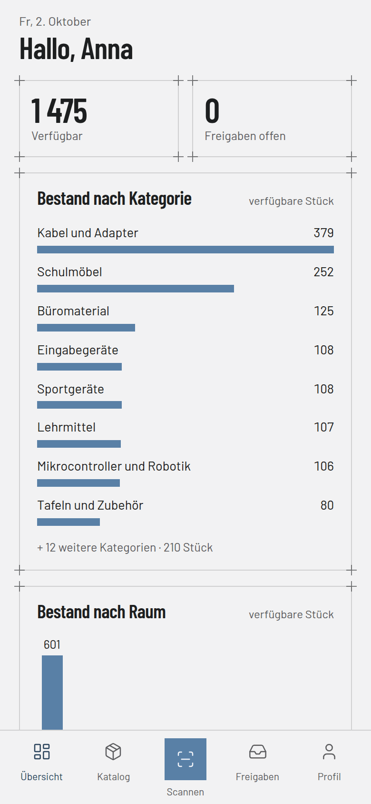 Übersicht</td>
    <td align="center">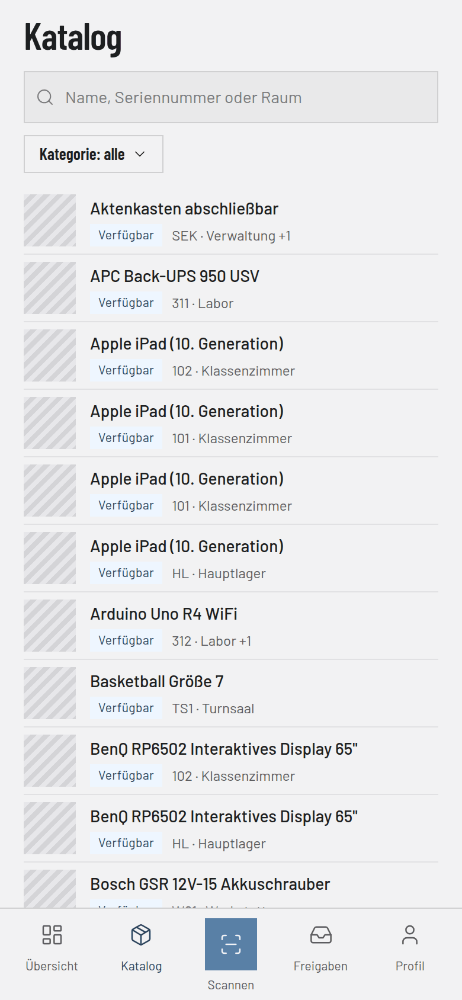 Katalog</td>
    <td align="center">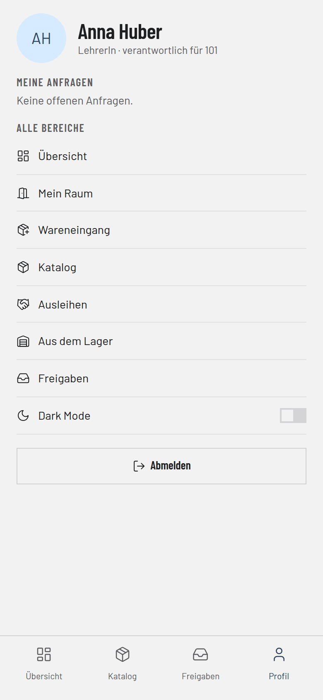 Profil mit allen Bereichen</td>
  </tr>
</table>

---

## 15. Häufige Fragen und Meldungen

| Frage oder Meldung | Antwort |
|---|---|
| *Ich sehe „Mein Raum“, „Wareneingang“, „Aus dem Lager“ und „Freigaben“ nicht.* | Sie sind für keinen Raum verantwortlich. Ein Admin weist Ihnen unter **Raumliste → Bearbeiten** einen Raum zu. |
| *Ich bin Admin, kann aber nichts transferieren.* | Buchen darf nur die verantwortliche Person eines Raums, auch ein Admin braucht dafür einen eigenen Raum. |
| *Ein Gerät fehlt in der Auswahl beim Wareneingang.* | Geräte mit Seriennummer, die schon in einem Raum liegen oder unterwegs sind, können nicht noch einmal eingebucht werden. Neue Gegenstände muss zuerst ein Admin im Katalog erfassen. |
| *Mein Zielraum fehlt bei „Ausleihen an“.* | Der Raum hat keine verantwortliche Person, die die Übernahme bestätigen könnte. |
| *Ich habe mich bei einer Anfrage vertan.* | Unter **Mein Raum → Angefragt, noch nicht freigegeben** auf **Zurückziehen** klicken, solange die andere Seite noch nicht freigegeben hat. |
| *„Bitte mindestens einen Gegenstand auswählen.“* | Es wurde kein Gerät hinzugefügt bzw. alle Mengen sind leer oder 0. |
| *„Bitte einen anderen Raum als den eigenen auswählen.“* | Ausleihen an den eigenen Raum ist nicht möglich. |
| *„Die Buchung konnte nicht gespeichert werden, da gleichzeitig andere Buchungen dieselben Daten geändert haben.“* | Jemand hat zur selben Zeit denselben Bestand geändert. Seite neu laden und noch einmal versuchen. |
| *„Der letzte Administrator kann nicht gelöscht werden.“* | Es muss immer mindestens eine Person mit Admin-Rolle geben. |
| *Gegenstand, Raum oder Person lässt sich nicht löschen.* | Was in Lagerbewegungen vorkommt, wird nie gelöscht, damit die Historie vollständig bleibt. Räume müssen außerdem leer sein, Personen dürfen für keinen Raum mehr verantwortlich sein. |
| *Ich habe mein Passwort vergessen.* | Ein Admin vergibt unter **Benutzer → Bearbeiten → Neues Passwort** ein neues. |
